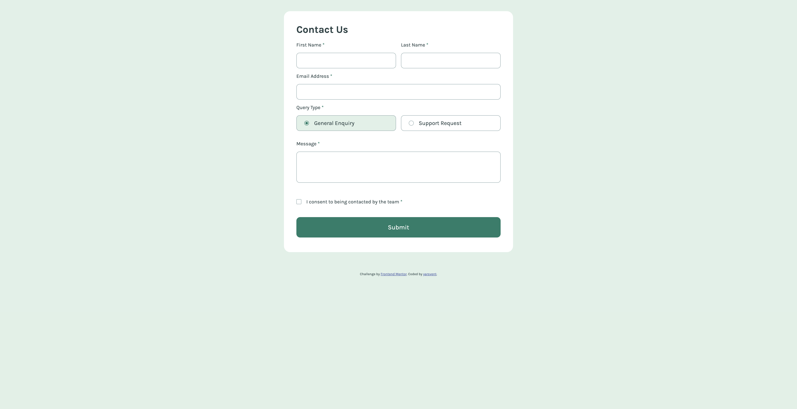
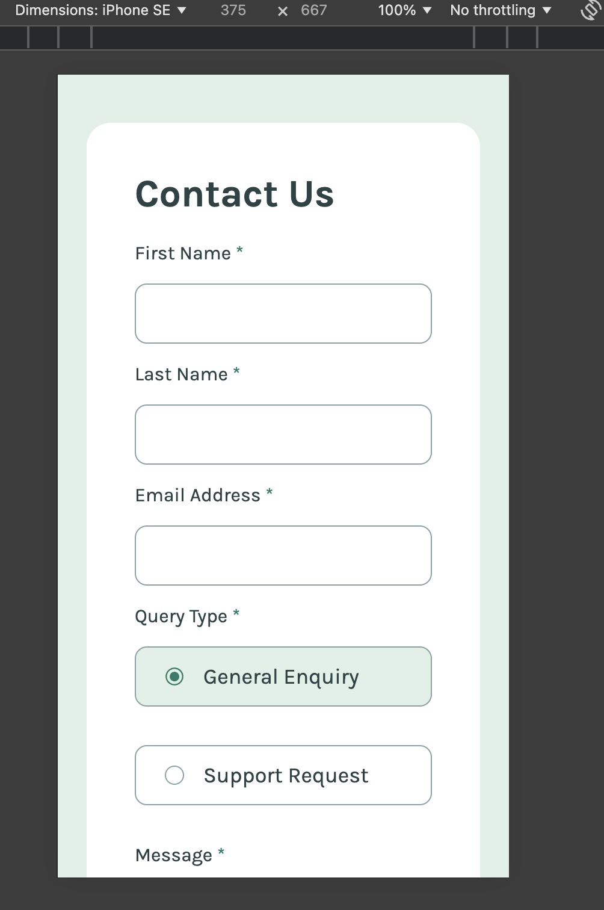

# Frontend Mentor - Contact form solution

This is a solution to the [Contact form challenge on Frontend Mentor](https://www.frontendmentor.io/challenges/contact-form--G-hYlqKJj). Frontend Mentor challenges help you improve your coding skills by building realistic projects.

## Table of contents

- [Overview](#overview)
  - [The challenge](#the-challenge)
  - [Screenshots](#screenshots)
  - [Links](#links)
- [My process](#my-process)
  - [Built with](#built-with)
  - [What I learned](#what-i-learned)
  - [Continued development](#continued-development)
- [Author](#author)

## Overview

### The challenge

Users should be able to:

- Complete the form and see a success toast message upon successful submission
- Receive form validation messages if:
  - A required field has been missed
  - The email address is not formatted correctly
- Complete the form only using their keyboard
- Have inputs, error messages, and the success message announced on their screen reader
- View the optimal layout for the interface depending on their device's screen size
- See hover and focus states for all interactive elements on the page

### Screenshots

### Links

- Solution URL: [Vercel](https://project-contact-form.vercel.app/)

## My process

First I created a pure html version of the page, then I began to style the form, added focus states, validation, error states and, finally, a success toast.

### Built with

- Semantic HTML5 markup
- CSS custom properties
- Flexbox
- JS DOM attributes
- Mobile-first

### What I learned

I learned to style forms, radio buttons, checkboxes, and to validate them using JavaScript, as well as how to use querySelectorAll and forEach. I also learned to use icons instead of default radio buttons.

### Continued development

I want to be able to have a better control and knowledge of events, form validation and DOM manipulation.

## Author

- Frontend Mentor - [@yarsvent](https://www.frontendmentor.io/profile/yarsvent)
